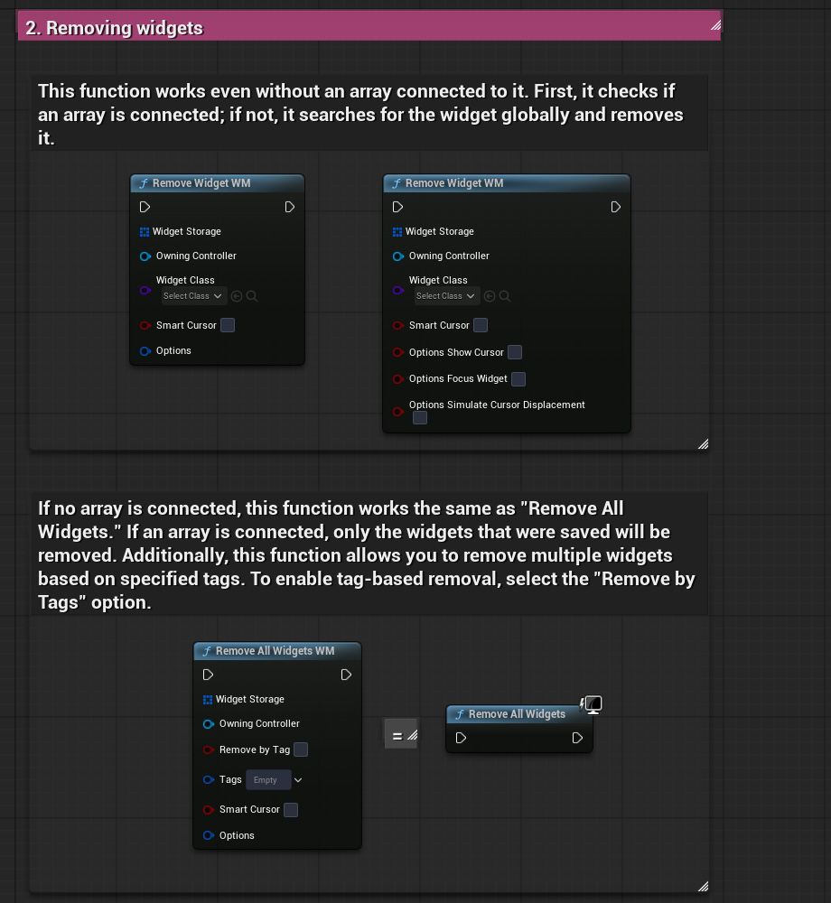

# Window Manager

## Features:
- Very fast UI customization in Unreal Engine!
- Multi-level window support
- Opening windows with replacement
- System for important windows (blocks opening of insignificant UI windows)
- Support adding child windows without replacement
- Support adding child windows with target content replacement

## Install: 
1. Move the "FeaturePacks" and "Samples" folders to the root folder with installed UE v.5.3.2.
2. Add MW files to your UE project.

## How to use it?: 
An interactive step-by-step tutorial on how to use WM can be found in the file: `BP_GameMode_WindowManager_demo`.

