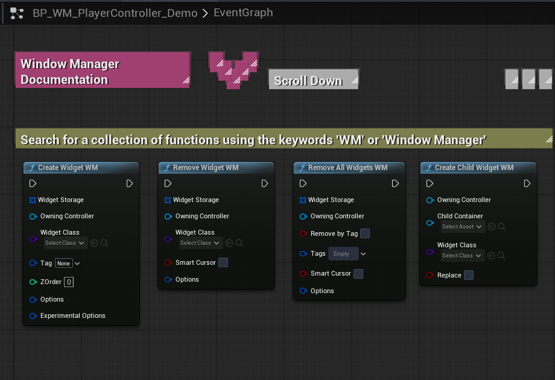

# Window Manager
`BETA`  
A plugin that includes a C++ library of universal widget management functions to help you quickly build interface logic using UMG in Unreal Engine 5.

 

> [!NOTE]
> The plugin has been pre-packaged only for Win64 and Android.

# Latest Updates
`Version 1.6.2`
- The plugin version has been updated to support Unreal Engine 5.7.
- The plugin’s functionality and its compilation for Windows and Android have been verified.

## What it's for
- Easy and fast setup of the widget management system.
- Simplified and minimized amount of code to add.
- Simultaneous configuration of cursor behavior, focus, and the restriction on creating new widgets.

## Features
- Very fast setup of user interface logic in Unreal Engine!
- Versatile functions for managing widgets can operate in multiple modes — both the standard Unreal Engine mode and with an optional external storage system for greater control.
- Remove specific widgets from almost anywhere in your project.
- Support for multi-layered windows with multiple groups.
- Automatic blocking of new widgets if more important ones have already been added.
- Open windows with automatic replacement of existing ones.
- Quickly add child windows to a container with optional content replacement.
- Mass close widget groups by a specified tag.

## Install

> [!NOTE]
> Starting with Unreal Engine version 5.6, it is recommended to use the new project type based on C++. Otherwise, when creating a new Blueprint project, you may encounter the following error: "Engine modules are out of date, and cannot be compiled while the engine is running. Please build through your IDE." This issue does not occur in a pure C++ project.

1. Make sure the Unreal Engine editor is closed.
2. Move the "Plugins" folder to the root folder of your created project.
3. Run your project to which the "Plugins" folder with WM was added. If a message about restoring the module appears, select "Yes".
4. Done! The Window Manager folders should appear in the Unreal Engine browser and the plugin should be automatically activated. If the plugin folder is not visible, activate visibility through the browser settings: `Settings > Show Plugin Content`.
5. Run the `L_WindowManager_Demo` test level, which is located in the Window Manager Content folder with the test files, and verify that the function works in C++.

## How to use it?
An interactive step-by-step tutorial on how to use WM can be found in the file: `BP_WM_PlayerController_Demo`, which is located at the path `Plugins\Window Manager Content\DemoFiles\BP\`.

## (C++) Documentaion
All sources contain self-documenting code.
