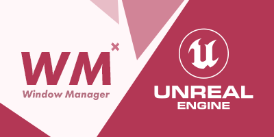

# Window Manager
`BETA`  
A plugin containing a versatile feature that will help you quickly customize interface logic using UMG in Unreal Engine 5. 
Blueprints and C++ versions will allow you to apply the most appropriate and convenient way of integration into your projects. 
  <i>(The plugin was pre-packaged on Win64 and Android only.)</i>

# Latest Updates
`Version 1.5`
- Build and recheck performance on Unreal Engine 5.5.0.
- Refactoring C++ and BP code. The basic functionality has not changed. Optimisation of calculations.

## What it's for
- Control important windows so that they are not blocked by anything.
- Simplify the logic on how to customize composite windows.
- Control the focus of windows without adding repetitive logic.
- Control the cursor display at the same time.
- Easily add child windows to the parent widget container.

## Features
- Very fast UI logic customization in Unreal Engine!
- Multi-level window support.
- Opening windows with replacement.
- System for important windows (blocks opening of insignificant UI windows).
- Support adding child windows.
- Supports both targeting a specific widget for closure (if specified in settings) and closing the most recently opened widget in the array by default (if no specific widget is selected for closure).

## Install
1. Make sure the Unreal Engine editor is closed.
2. Move the "Plugins" folder to the root folder of your created project.
3. Run your project to which the "Plugins" folder with WM was added. If a message about restoring the module appears, select "Yes".
4. Done! The Window Manager folders should appear in the Unreal Engine browser and the plugin should be automatically activated. If the plugin folder is not visible, activate visibility through the browser settings: `Settings > Show Plugin Content`.
5. Run the `L_WM_PreviewMap` test level, which is located in the Window Manager Content folder with the test files, and verify that the function works in C++.

## How to use it?
An interactive step-by-step tutorial on how to use WM can be found in the file: `BP_PlayerController_WindowManager_demo`, which is located at the path `Plugins\Window Manager Content\DemoFiles\BP\`.

## (C++) Documentaion
All sources contain self-documenting code. C++ and BP functions are completely identical and interchangeable.

Description of the main parameters of the main function: 
`TArray<UUserWidget*> ArrayWidgetsRef` - stores active widgets and their names. 
`bool bWindowsOpened` - stores information about at least one open widget with WM. 
`bool bActionOpen` - specifies the action of adding the widget (true) or closing it (false). 
`bool bActionCloseAll` - closes all created widgets. 
`TSubclassOf<UUserWidget> WidgetClass` - target widget. 
`APlayerController* OwningController` - owning player controller. 
`bool bIsReplaced` - whether the last open widget will be replaced by a new one. 
`bool bShowCursor` - show cursor. 
`bool bFocusViewport` - keeps focus on the viewport. 
`int32 ZOrder` - adjusts the display priority of the widget layer. 
`UPanelWidget* ChildContainer` - target container where the widget will be embedded (can be empty). 
`TArray<UUserWidget*> &ReturnArrayWidgetsRef` - returns an updated list of open widgets. 
`bool& bReturnWindowsOpened` - returns information about at least one open widget with WM. 
